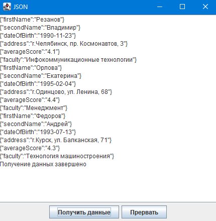

# Lesson 13 #
### Задание   ###
На основе фреймворка WebFlux/(любой другой реактивный фреймворк)
сделать приложение-сервер и простенький UI, который будет
запрашивать из сервера информацию в формате json, а тот будет ему
отправлять json чанками с интервалом в 5 секунд между чанками, пока не
отправит все чанки.
UI должен корректно отобразить JSON и провалидировать (парсится без
ошибок).

Пример json: 
`[{field:value}, 
{field:value},
{field:value},
{field:value},
{} ,{} ,{}]` 
* Повышенный уровень сложности. Мы должны уметь прервать выполнение
этого запроса и прекратить процесс на стороне сервера.

### Реализация ###
Для отправки JSON были созданы классы: Student(объекты содержащиеся в JSON) и 
JSONController (отвечает за формирование и отправку JSON).  
Запуск производить класса Main.  
Пример UI:  

  При нажатии на кнопку "Получить данные" в текстовое поле выводится один chunk JSON
с периодичностью раз в 5 сек.

Для возможности прерывания запроса использован механизм отмены 
событий в Reactor через использование Disposable.
